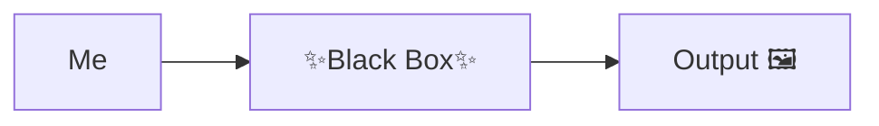

---
# You can also start simply with 'default'
theme: the-unnamed
# random image from a curated Unsplash collection by Anthony
# like them? see https://unsplash.com/collections/94734566/slidev
background: https://cover.sli.dev
# some information about your slides (markdown enabled)
title: "From ChatGPT User to RAG Implementer: A Developer's Journey"
info: |
  ## From ChatGPT User to RAG Implementer: A Developer's Journey

  A story of a developer who didn't care about LLMs
  And then he started
# apply unocss classes to the current slide
class: text-center
# https://sli.dev/features/drawing
drawings:
  persist: false
# slide transition: https://sli.dev/guide/animations.html#slide-transitions
transition: slide-left
# enable MDC Syntax: https://sli.dev/features/mdc
mdc: true
# take snapshot for each slide in the overview
overviewSnapshots: true
aspectRatio: 16/9
monaco: false
layout: intro
---

# From ChatGPT User to RAG Implementer: A Developer's Journey

---
class: text-center
layout: cover
---
# I'm Pasha

---
class: text-center
layout: cover
---

# And this is my story

---

# I'm Pasha

I used to be a ChatGPT user

And I didn't really care about its internals

I didn't need to know much about LLMs

I didn't hear about RAG (Retrieval-augmented generation)

---

# Of course…

I heard about neural networks
  

But what the heck is this?

---
class: text-center
---

# How I perceived LLMs

---

# Time to tell about me

1. I work with JVM languages for almost 15 years 
2. I used to be a
   1. Backend developer
   2. Data engineer
   3. Engineering manager
3. Worked with data scientists, product managers, and other stakeholders
4. Usually did performance optimizations
5. Worked with Spring and without it

---

# And now…

1. Developer Advocate at BellSoft
2. Have a lot of time to experiment
3. Need to produce content for the community
4. Still love to code

<!-- 
 -->

Follow me, BTW!

<logos-bluesky /> asm0dey

<logos-twitter /> asm0di0

<logos-mastodon-icon /> @asm0dey@fosstodon.org

<!-- 
 -->

---

# One day…

I founds that we have A LOT of documents:

1. Blog posts
2. Documentation
3. Whitepapers

And I just can't find my way through them

So I decided to do something about it

---

# Looking for solution

<ul>
  <li v-click="1">Elasticsearch?</li>
  <li v-click="2">Google Desktop?</li>
  <li v-click="4">

`grep`?
  
  </li>
</ul>

---
layout: image
image: /yak.jpg
backgroundSize: contain
---

<!-- 
  <!-- src="/yak.jpg" -->
  <!-- class="w-auto h-130" -->
<!-- /> -->

---

# Luckily I have a friend

Who I could ask stupid questions (thanks @shrimpsizemoose)
<v-click> What did I ask?</v-click>

<v-click>

> How do I search thru my documents? You do this neural network magic for years, right?
</v-click>
<v-click>

He's a good friend, so he didn't answer, but asked what I know
</v-click>
<v-click>
I:

> Well, word2vec, layers, embedding!

</v-click>

<v-click>
He:

> Explain me embeddings then
</v-click>
<v-click> I couldn't </v-click>

---

# Embeddings

Here's an embedding

`[0.123, -0.456, 0.789, -0.234, 0.567, -0.890, 0.345, -0.678, 0.901, -0.432]`

And one more:

`[0.234, -0.567, 0.890, -0.123, 0.456, -0.789, 0.321, -0.654, 0.987, -0.345]`

What do they mean?

We do not know. Nothing in this context

---

# What is an embedding?

An embedding is a way to represent something (like a word, image, or document) as a list of numbers

<v-click>

Think of it like GPS coordinates:
- "New York" → (40.7128° N, 74.0060° W)
- "Tokyo" → (35.6762° N, 139.6503° E)
</v-click>

<v-click>

Just like coordinates tell us where cities are in physical space...

Embeddings tell us where things are in "meaning space" 🤯
</v-click>

<v-click>

Similar things should have similar coordinates:
- "cat" and "kitten" would be close together
- "cat" and "rocket" would be far apart
</v-click>

---

# Example: Family relationships in meaning space

<v-click>

Let's look at a famous example:

"king" - "man" + "woman" ≈ "queen"
</v-click>

<v-click>

Similarly:

"father" - "man" + "woman" ≈ "mother"
</v-click>

<v-click>

This shows that embeddings capture relationships:
- The difference between "father" and "mother" is similar to the difference between "man" and "woman"
- The "parent" concept stays constant while the gender changes
</v-click>

<v-click>

These relationships emerge naturally when AI models learn from text!
</v-click>

---

# Word2Vec: A Breakthrough in Word Embeddings

<v-click>

Word2Vec was introduced by Google researchers in 2013:
- First major breakthrough in creating meaningful word embeddings
- Made it practical to capture word relationships in vector space
</v-click>

---

# How Word2Vec Works

<v-click>

The core idea is learning from context:
- Predicts words that appear near each other
- If words often appear in similar contexts, they get similar embeddings
</v-click>

<v-click>

For example:
- "cat" and "dog" often appear near words like:
  - "pet"
  - "food" 
  - "vet"
</v-click>

---

# Word2Vec's Key Innovations

<v-click>

Technical breakthroughs:
- Much faster training than previous methods
- Produced higher quality embeddings
</v-click>

<v-click>

Conceptual breakthrough:
- Showed that simple neural networks could capture complex meaning
</v-click>

---

# Word2Vec's Impact

<v-click>

Changed the field of NLP:
- Sparked a revolution in natural language processing
- Laid groundwork for modern language models
- Still used today in many applications
</v-click>

---

# Word2Vec Results

<v-click>

The output is word embeddings:
- Each word becomes a <abbr title="A compact numerical representation where most values are non-zero, unlike sparse vectors">dense vector of numbers</abbr>
- Similar words have similar vectors
- Vector math captures semantic relationships
</v-click>

<v-click>

Properties of the vectors:
- Typically 100-300 dimensions
- Enable measuring word similarity
- Can be visualized in lower dimensions
</v-click>

---

# Word2Vec's Limitations

Technical limitations:

- Fixed context window misses broader document meaning
- Cannot handle polysemy (same word with different meanings)
- Requires pre-trained embeddings for each word

---

# Modern Alternatives

Superseded by newer architectures:

- <abbr title="Bidirectional Encoder Representations from Transformers">BERT</abbr> and other transformers learn contextual embeddings
- Large language models capture richer relationships
- Modern models handle multiple word meanings

---

# Word2Vec's Legacy

Still relevant today:

- Pioneered neural word embeddings
- Core concepts influence modern NLP
- Useful for simple NLP tasks
- Good for learning fundamentals

---

# Text Embeddings

Similar concept, but for chunks of text:

Instead of:
`"cat"` → `[0.1, 0.2, -0.3, ...]`

We get:
`"The cat sat on the mat"` → `[0.4, -0.2, 0.1, ...]`

---

# Benefits

- Captures meaning of entire passages
- Similar texts get similar vectors
- Can compare documents, paragraphs, or sentences

---

# Use Cases

- Semantic search (find similar documents)
- Document clustering
- Question answering
- Text classification

---

# How Text Embeddings Work

<v-clicks>

- Split text into tokens
- Process through neural network layers:
  - Embedding layer converts tokens to vectors
  - Attention layers capture relationships
  - Feed-forward layers transform data
  - Pooling layers combine information
- Combine token representations
- Output fixed-size vector

</v-clicks>

---

# Popular models

- OpenAI's text-embedding-ada-002
- Sentence-BERT
- Universal Sentence Encoder

---

