---
# You can also start simply with 'default'
theme: the-unnamed
# random image from a curated Unsplash collection by Anthony
# like them? see https://unsplash.com/collections/94734566/slidev
background: https://cover.sli.dev
# some information about your slides (markdown enabled)
title: "From ChatGPT User to RAG Implementer: A Developer's Journey"
info: |
  ## From ChatGPT User to RAG Implementer: A Developer's Journey

  A story of a developer who didn't care about LLMs
  And then he started
# apply unocss classes to the current slide
class: text-center
# https://sli.dev/features/drawing
drawings:
  persist: false
# slide transition: https://sli.dev/guide/animations.html#slide-transitions
transition: slide-left
# enable MDC Syntax: https://sli.dev/features/mdc
mdc: true
# take snapshot for each slide in the overview
overviewSnapshots: true
aspectRatio: 16/9
monaco: false
layout: cover
---

# From ChatGPT User to RAG Implementer: A Developer's Journey

---
class: text-center
layout: cover
---
# I'm Pasha

---
class: text-center
layout: cover
---

# And this is my story

---

# I'm Pasha

I used to be a ChatGPT user

And I didn't really care about its internals

I didn't need to know much about LLMs

I didn't hear about RAG (Retrieval-augmented generation)

---

# Of course…

I heard about neural networks
  

But what the heck is this?

---
class: text-center
---

# How I perceived LLMs

```mermaid
graph LR
    Me --> B[✨Black Box✨]
    B[✨Black Box✨] --> Output[Output 🖼️]
```

---

# Time to tell about me

1. I work with JVM languages for almost 15 years 
2. I used to be a
   1. Backend developer
   2. Data engineer
   3. Engineering manager
3. Worked with data scientists, product managers, and other stakeholders
4. Usually did performance optimizations
5. Worked with Spring and without it

---

# And now…

1. Developer Advocate at BellSoft
2. Have a lot of time to experiment
3. Need to produce content for the community
4. Still love to code

Follow me!

<logos-bluesky /> asm0dey

<logos-twitter /> asm0di0

<logos-mastodon-icon /> @asm0dey@fosstodon.org

---

# One day…

I founds that we have A LOT of documents:

1. Blog posts
2. Documentation
3. Whitepapers

And I just can't find my way through them

So I decided to do something about it

---

# Looking for solution

<ul>
  <li v-click="1">Elasticsearch?</li>
  <li v-click="2">Google Desktop?</li>
  <li v-click="4">

`grep`?
  
  </li>
</ul>

---
layout: center
---

---

# Luckily I have a friend

