---
# You can also start simply with 'default'
theme: the-unnamed
# random image from a curated Unsplash collection by Anthony
# like them? see https://unsplash.com/collections/94734566/slidev
background: https://cover.sli.dev
# some information about your slides (markdown enabled)
title: "From ChatGPT User to RAG Implementer: A Developer's Journey"
info: |
  ## From ChatGPT User to RAG Implementer: A Developer's Journey

  A story of a developer who didn't care about LLMs
  And then he started
# apply unocss classes to the current slide
class: text-center
# https://sli.dev/features/drawing
drawings:
  persist: false
# slide transition: https://sli.dev/guide/animations.html#slide-transitions
transition: slide-left
# enable MDC Syntax: https://sli.dev/features/mdc
mdc: true
# take snapshot for each slide in the overview
overviewSnapshots: true
aspectRatio: 16/9
monaco: false
layout: center
addons:
    - slidev-addon-qrcode
---

# From ChatGPT User to RAG Implementer: A Developer's Journey

---
class: text-center
layout: cover
---
# I'm Pasha

---
class: text-center
layout: cover
---

# And this is my story

---

# I'm Pasha

I used to be a ChatGPT user

And I didn't really care about its internals

I didn't need to know much about LLMs

I didn't hear about RAG (Retrieval-augmented generation)

---
layout: center
---

# Who is like me here?

I will cross some T's in this talk

---
layout: center
---

# Of course…

I heard about neural networks
  

But what the heck is this?

---
class: text-center
---

# How I perceived LLMs

```mermaid
graph LR
    Me --> B[✨Black Box✨]
    B[✨Black Box✨] --> Output[Output 🖼️]
```

---

# Time to tell about me

1. I work with JVM languages for almost 15 years 
2. I used to be a
   1. Backend developer
   2. Data engineer
   3. Engineering manager
3. Worked with data scientists, product managers, and other stakeholders
4. Usually did performance optimizations
5. Worked with Spring and without it

---

# And now…

1. Developer Advocate at BellSoft
2. Have a lot of time to experiment
3. Need to produce content for the community
4. Still love to code

Follow me, BTW!

<logos-bluesky /> asm0dey

<logos-twitter /> asm0di0

<logos-mastodon-icon /> @asm0dey@fosstodon.org

---

# One day…

I founds that we have A LOT of documents:

1. Blog posts
2. Documentation
3. Whitepapers

And I just can't find my way through them

So I decided to do something about it

---

# Looking for solution

<ul>
  <li v-click="1">Elasticsearch?</li>
  <li v-click="2">Google Desktop?</li>
  <li v-click="4">

`grep`?
  
  </li>
</ul>

---
layout: image
image: /yak.jpg
backgroundSize: contain
---

<!-- 
  <!-- src="/yak.jpg" -->
  <!-- class="w-auto h-130" -->
<!-- /> -->

---
layout: center
---

# Let's use AI!

But how?

---

# Luckily I have a friend

Who I could ask stupid questions (thanks @shrimpsizemoose)

<v-click> What did I ask?</v-click>

<v-click>

> How do I search thru my documents? You do this neural network magic for years, right?

</v-click>
<v-click>

He's a good friend, so he didn't answer, but asked what I know

</v-click>
<v-click>
I:

> Well, word2vec, layers, embedding!

</v-click>

<v-click>
He:

> Explain me embeddings then

</v-click>
<v-click> I couldn't </v-click>

---

# Embeddings

Here's an embedding

`[0.123, -0.456, 0.789, -0.234, 0.567, -0.890, 0.345, -0.678, 0.901, -0.432]`

And one more:

`[0.234, -0.567, 0.890, -0.123, 0.456, -0.789, 0.321, -0.654, 0.987, -0.345]`

What do they mean?

We do not know. Nothing in this context

---

# What is an embedding?

An embedding is a way to represent something (like a word, image, or document) as a list of numbers

<v-click>

Think of it like GPS coordinates:
- "New York" → (40.7128° N, 74.0060° W)
- "Tokyo" → (35.6762° N, 139.6503° E)

</v-click>

<v-click>

Just like coordinates tell us where cities are in physical space...

Embeddings tell us where things are in "meaning space" 🤯

</v-click>

<v-click>

Similar things should have similar coordinates:
- "cat" and "kitten" would be close together
- "cat" and "rocket" would be far apart

</v-click>

---

<SlidevVideo autoplay="once" controls="true" autoreset="slide">
  <source src="/WordEmbeddingAnalogy.webm" type="video/webm" />
  <source src="/WordEmbeddingAnalogy.mp4" type="video/mp4" />
    

    Your browser does not support videos. You may download it
    <a href="/WordEmbeddingAnalogy.mp4">here</a>.
  

</SlidevVideo>

---

# Example: Family relationships in meaning space

<v-click>

Let's look at a famous example:

"king" - "man" + "woman" ≈ "queen"

</v-click>

<v-click>

Similarly:

"father" - "man" + "woman" ≈ "mother"

</v-click>

<v-click>

This shows that embeddings capture relationships:
- The difference between "father" and "mother" is similar to the difference between "man" and "woman"
- The "parent" concept stays constant while the gender changes

</v-click>

<v-click>

These relationships emerge naturally when AI models learn from text!

</v-click>

---

# Word2Vec: A Breakthrough in Word Embeddings

<v-click>

Word2Vec was introduced by Google researchers in 2013:
- First major breakthrough in creating meaningful word embeddings
- Made it practical to capture word relationships in vector space

</v-click>

---

# How Word2Vec Works

<v-click>

The core idea is learning from context:
- Predicts words that appear near each other
- If words often appear in similar contexts, they get similar embeddings

</v-click>

<v-click>

For example:
- "cat" and "dog" often appear near words like:
  - "pet"
  - "food" 
  - "vet"

</v-click>

---

# Word2Vec's Key Innovations

<v-click>

Technical breakthroughs:
- Much faster training than previous methods
- Produced higher quality embeddings

</v-click>

<v-click>

Conceptual breakthrough:
- Showed that simple neural networks could capture complex meaning

</v-click>

---

# Word2Vec's Impact

<v-click>

Changed the field of NLP:
- Sparked a revolution in natural language processing
- Laid groundwork for modern language models
- Still used today in many applications

</v-click>

---

# Word2Vec Results

<v-click>

The output is word embeddings:
- Each word becomes a <abbr title="A compact numerical representation where most values are non-zero, unlike sparse vectors">dense vector of numbers</abbr>
- Similar words have similar vectors
- Vector math captures semantic relationships

</v-click>

<v-click>

Properties of the vectors:
- Typically 100-300 dimensions
- Enable measuring word similarity
- Can be visualized in lower dimensions

</v-click>

---

# Word2Vec's Limitations

Technical limitations:

- Fixed context window misses broader document meaning
- Cannot handle polysemy (same word with different meanings)
- Requires pre-trained embeddings for each word

---

# Modern Alternatives

Superseded by newer architectures:

- <abbr title="Bidirectional Encoder Representations from Transformers">BERT</abbr> and other transformers learn contextual embeddings
- Large language models capture richer relationships
- Modern models handle multiple word meanings

---

# Text Embeddings

Similar concept, but for chunks of text:

Instead of:
`"cat"` → `[0.1, 0.2, -0.3, ...]`

We get:
`"The cat sat on the mat"` → `[0.4, -0.2, 0.1, ...]`

---

# Benefits

- Captures meaning of entire passages
- Similar texts get similar vectors
- Can compare documents, paragraphs, or sentences

---

# Use Cases

- Semantic search (find similar documents)
- Document clustering
- Question answering
- Text classification

---

# How Text Embeddings Work

<v-clicks>

- Split text into tokens
- Process through neural network layers:
  - Embedding layer converts tokens to vectors
  - Attention layers capture relationships
  - Feed-forward layers transform data
  - Pooling layers combine information
- Combine token representations
- Output fixed-size vector

</v-clicks>

---

# Popular models

- OpenAI's `text-embedding-ada-002`
- <abbr title="A variant of BERT fine-tuned for sentence-level tasks like similarity and clustering">
  Sentence-BERT</abbr>
- <abbr title="A pre-trained model by Google designed for encoding sentences into embedding vectors for semantic similarity tasks">
  Universal Sentence Encoder</abbr>

---

# Why do we need embeddings?

<v-clicks>

- Embeddings convert text into numbers that capture meaning
- Similar texts get similar vectors, enabling semantic search
- RAG workflow:
  1. Convert documents to embeddings and store them
  2. Convert user query to embedding
  3. Find most similar document embeddings
  4. Feed relevant documents to LLM as context
- This is not only a search, but also summarization!

</v-clicks>

---

# But can't we just…

save data in a database and ask LLM to access it?

<v-click>
No!

- The whole NN is a huge bunch of hardcoded weights

</v-click>
<v-click at="4">

- NN can't access anything directly, it's not a program, more of a data structure

</v-click>

---

# And here I hear the magic word

## RAG (Retrieval Augmented Generation)

Essentially, the idea is to mix relevant data into prompt and make LLM use it

---

# How to implement RAG?

1. Convert documents to embeddings
2. Store them in a vector database
3. Convert user query to embedding
4. Find most similar document embeddings
5. Feed relevant documents to LLM as context

---

# 1. Convert documents to embeddings

- Not all documents can be converted to embeddings directly
  - Text needs to be split into chunks
  - Each chunk has a maximum <abbr title="A token is a piece of text, like a word or part of a word">token</abbr> limit:
    - OpenAI ada-002: 8,191 tokens
    - Mistral-7B: 8,192 tokens
    - Claude: 8,000 tokens
  - Need to balance chunk size:
    - Too small → loses context
    - Too large → less precise matches
- Some information may be lost in the conversion process

---

# 2. Store them in a vector database

## Where?

Vector database is a specialized database for storing and searching vectors

Key features:

- Efficient similarity search:
  - Cosine similarity: $\cos(\theta) = {\mathbf{A} \cdot \mathbf{B} \over \|\mathbf{A}\| \|\mathbf{B}\|}$
  - Euclidean distance: $\sqrt{\sum(a_i - b_i)^2}$
  - Dot product: $\sum_{i} a_i b_i$
- Optimized for high-dimensional data
- Can store metadata alongside vectors

---

<SlidevVideo autoplay="once" controls="true" autoreset="slide">
  <source src="/CosineDistanceVisualization.webm" type="video/webm" />
  <source src="/CosineDistanceVisualization.mp4" type="video/mp4" />
    

    Your browser does not support videos. You may download it
    <a href="/CosineDistanceVisualiztion.mp4">here</a>.
  

</SlidevVideo>

---

# 2. Store them in a vector database

## For example

- Chroma
- Weaviate 
- Pinecone
- Milvus
- pgvector (PostgreSQL extension)

---
layout: center
---
# This is how it works

---

# 3. Convert user query to embedding

Same as with document.

Probably return an error if the query is too big.

---

# 4. Find most similar document embeddings

- Use vector database to find closest embeddings to query embedding
- Usually returns:
  - Distance/similarity score
  - Original text
  - Optional metadata
- Can limit number of results (e.g. top-k)
- Can filter by metadata (e.g. only search specific document types)

---

# 5. Feed relevant documents to LLM as context

- Take relevant documents from vector search
- Add them as context to LLM prompt
- Ask LLM to answer based on provided context
- LLM generates response using only provided context
- Response is more accurate and grounded in your documents

---
layout: two-cols
---

# This is how it works

::right::

---
layout: center
---

# Demo!

---

# Summary

- RAG is simple
- You need to know embeddings to understand RAG
- Embeddings are not magic, they are just vectors
- You don't need to know how LLM works to use RAG

---
layout: two-cols-header
---

# Questions?

::left::

<logos-bluesky /> asm0dey

<logos-twitter /> asm0di0

<logos-mastodon-icon /> @asm0dey@fosstodon.org

::right::

Blog:
<QRCode
    :width="150"
    :height="150"
    type="svg"
    data="https://bit.ly/48WTkL5"
    :margin="10"
    :imageOptions="{ margin: 10 }"
    :dotsOptions="{ type: 'extra-rounded', color: 'white' }"
/>

Source code:
<QRCode
    :width="150"
    :height="150"
    type="svg"
    data="https://github.com/asm0dey/bellsoft-docs-bot"
    :margin="10"
    :imageOptions="{ margin: 10 }"
    :dotsOptions="{ type: 'extra-rounded', color: 'white' }"/>

---
layout: end
---
